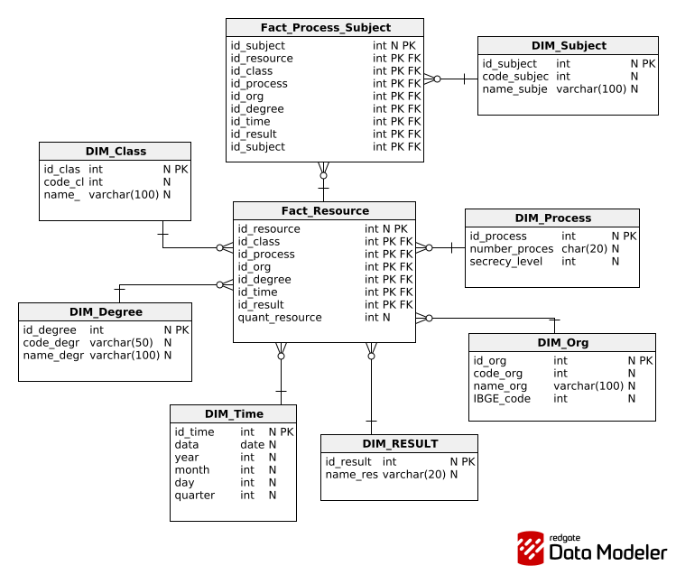

# Dimensional Models — DatumLex

These diagrams are modeling artifacts, not proof of approval or implementation.
US-04–US-06 require consistent grain, keys, outcomes, source mapping, and a reviewed
data dictionary before dependent implementation. Sprint 1 is DataJud-only; Sprint 2
provenance extensions require explicit reviewed revisions. Modeling effort is
included in story-level `Estimate`; see the
[planning agreement](../agile/estimation-and-prioritization.md).

## Conceptual model

## Logical model

## Physical model

## Review observations — September 15, 2026

The current logical/physical diagrams show process counts, degree, time, class,
organization, and subjects. They do not yet display explicit outcome evidence,
classification versions, refresh metadata, or the appeal/judgment grain required
by US-04–US-09. Validate those requirements before treating the drawings as a
complete merit-analytics model. Check that the subject bridge does not multiply
measures and clarify the role of time/class/organization keys in the physical
fact key.

`number_process` is drawn as Bigint. Validate storing a full process identifier
as text: identifiers can require preserved leading zeroes and exceed a signed
64-bit integer. This review records the concern; it does not alter the schema.
The full data dictionary and modeling approval evidence remain separate required
deliverables, not implied by the existence of these images.
