# End-to-End Development Process — DatumLex

## Purpose

This document explains how work moves through DatumLex from an identified need
to a reviewed, integrated, and traceable product increment. It connects the
project's role guides and working agreements without duplicating their detailed
rules.

Use this document as the process map. Follow the linked standard whenever a
step requires implementation, review, or role-specific detail.

## Guiding principles

- The [GitHub Product Backlog](https://github.com/orgs/DatumLex/projects/1) is
  the live source for scope, hierarchy, assignees, sprint, priority, `Estimate`, and status.
- The linked GitHub issue is the durable record of acceptance criteria,
  dependencies, decisions, blockers, deliverables, and evidence.
- Work is not complete merely because code exists, a branch was pushed, or a
  Pull Request was merged.
- Product value, implementation quality, review, QA, documentation, and
  integration are visible parts of the same delivery process.
- Status must reflect reality. Planned dates, commits, and activity do not
  replace explicit board updates and evidence.
- Product, code, issue, PR, and project documentation are written in English.

## Process overview

```mermaid
flowchart LR
    A[Need or opportunity] --> B[Backlog item]
    B --> C[Refinement and readiness]
    C -->|Ready| D[Sprint planning]
    D --> E[Implementation]
    E --> F[Developer validation]
    F --> G[Pull Request]
    G --> H[Code review and QA]
    H -->|Changes required| E
    H -->|Approved| I[Merge and integration]
    I --> J[Deployment and smoke checks]
    J --> K[PO acceptance]
    K -->|Accepted and DoD met| L[Done]
    K -->|Follow-up required| B
    L --> M[Sprint review and retrospective]
```



Not every item requires production deployment or PO acceptance at task level.
Record `N/A — <reason>` only when the
[Definition of Done](../agile/definition-of-done.md) permits it. A user story
requiring an integrated product outcome cannot use a completed isolated task as
a substitute for integration.

## Board workflow

```text
Backlog → Ready → In progress → In review → Done
```

| Status | Entry condition | Exit condition |
|---|---|---|
| `Backlog` | Execution waits on a dependency or required input; record the blocker. | The required input exists and applicable readiness criteria are satisfied. |
| `Ready` | Scope, required inputs, owner, validation approach, and start dependencies satisfy the Definition of Ready. | The assignee actually begins work. |
| `In progress` | Implementation, research, design, documentation, or another defined activity has started. | Deliverable and evidence are ready for independent review. |
| `In review` | The author has completed applicable checks and provided a reviewable artifact with evidence. | Changes return the item to `In progress`, or approval and remaining completion steps allow it to become `Done`. |
| `Done` | Acceptance criteria and applicable Definition of Done checks are satisfied, with review and evidence recorded. | Reopened only when the accepted result is invalidated; new scope normally becomes a new linked item. |

See the [Agile Glossary](../agile/glossary.md),
[Definition of Ready](../agile/definition-of-ready.md), and
[Definition of Done](../agile/definition-of-done.md) for exact policies.

## End-to-end workflow

### 1. Identify a need or opportunity

**Primary owner:** Product Owner  
**Contributors:** Stakeholders, Scrum Master, Developers, QA, design and data
specialists

Capture the user problem, expected value, relevant evidence, urgency, and known
constraints. A request is not automatically a commitment. The Product Owner
decides whether it belongs in the Product Backlog and how it relates to the
Product Goal.

**Required record:** a backlog item or an explicit decision not to pursue it.

### 2. Structure the backlog item

**Primary owner:** Product Owner  
**Facilitator:** Scrum Master  
**Technical contributors:** Developers and reviewers

Use an epic for a broad objective, a user story for a valuable and testable user
outcome, and tasks for focused delivery work. Link parent and child items.

Record:

- user value, scope, and exclusions;
- acceptance criteria and expected failure states;
- business, legal, metric, data, and accessibility rules;
- dependencies and required source artifacts;
- validation and completion evidence; and
- priority, sprint candidate, and expected ownership.

Follow the [Product Owner Guide](../agile/product-owner-guide.md) and
[Agile Glossary](../agile/glossary.md).

### 3. Refine and assess readiness

**Accountable for product clarity:** Product Owner  
**Accountable for technical readiness:** Assignee and relevant technical owners  
**Facilitator:** Scrum Master

Apply the [Definition of Ready](../agile/definition-of-ready.md). Resolve or
explicitly record unclear behavior, unavailable access, missing contracts,
unresolved dependencies, sizing concerns, and the validation approach.

Move `Backlog → Ready` only when work can responsibly start. A completion
dependency may remain if it does not prevent the independent task from
beginning; record it clearly. For example, a frontend shell can start from an
approved design and contract while real-data integration remains a later
completion requirement.

**Required evidence:** a readiness comment or issue content showing inputs,
dependencies, validation plan, owner, and decision.

### 4. Plan the sprint

**Shared ownership:** Scrum Team

The Product Owner explains the ordered backlog and desired value. Developers
select a realistic plan based on capacity, dependencies, technical sequencing,
QA effort, and the Sprint Goal. The Scrum Master facilitates and exposes risks.

Confirm story-level `Estimate` from Planning Poker, sprint, priority, assignee, planned sequence, review capacity, and the
relationship of each selected item to the Sprint Goal. Planning does not change
an item to `In progress`; execution must actually begin.

### 5. Start implementation

**Primary owner:** Assigned developer or specialist

Move `Ready → In progress`, create a branch following
[Branch Standards](branch-standards.md), and add a concise issue
comment when the approach, dependencies, or limitations need to be visible.

Developers follow the [Developer Guide](developer-guide.md),
[Technology Stack](../architecture/technology-stack.md), and applicable
[Design Standards](../design/datumlex-design-guide.pdf).

Implementation includes the necessary code, tests, data rules, configuration,
documentation, accessibility behavior, error handling, and traceability for the
item's scope.

### 6. Commit and maintain traceability

**Primary owner:** Author

Create small, logical, English commits following
[Commit Standards](commit-standards.md). Reference the issue with
`Refs #<number>` when work contributes to it. Use `Resolves #<number>` only when
the entire item will genuinely be satisfied by the merge.

Keep the card current when:

- implementation begins or materially changes;
- a dependency or blocker appears;
- scope is clarified or deferred;
- a deliverable becomes available; or
- validation produces meaningful evidence.

### 7. Perform author validation

**Primary owner:** Author

Before requesting review, validate the deliverable in proportion to its risk.
Apply the relevant checks from the
[Definition of Done](../agile/definition-of-done.md):

- build, lint, static analysis, unit, integration, API, or UI tests;
- responsive and accessibility checks;
- data quality and reconciliation;
- document or design rendering and link validation;
- migration, deployment, or configuration checks; and
- explicit error, empty, unavailable, and partial-data states.

Record commands, environment, version or commit, results, screenshots, reports,
and known limitations. A screenshot alone does not prove functional behavior.

### 8. Open a Pull Request

**Primary owner:** Author

Push the branch and open a focused Pull Request. The PR must:

- use an English title aligned with the commit convention;
- link the issue;
- explain the problem, solution, scope, and important decisions;
- list validation evidence and affected documentation;
- include relevant screenshots or reports; and
- disclose limitations and follow-up items.

Move `In progress → In review` and comment on the issue only when the change is
actually ready for independent review. Follow the
[Developer Guide](developer-guide.md) and
[QA Guide](qa-guide.md).

### 9. Perform code review and QA

**Primary owners:** Independent reviewer and QA  
**Support:** Author and Scrum Master

Review the issue, acceptance criteria, implementation, tests, documentation,
risk, and evidence. QA validates expected behavior and relevant regression
scenarios. Meaningful findings and decisions must be recorded in the PR and on
the related issue.

Possible outcomes:

- **Approved:** evidence supports the change and no blocking issue remains.
- **Changes required:** move the card to `In progress`, correct the change,
  revalidate, and request another review.
- **Blocked:** record the cause, impact, owner, next action, and follow-up date.

Use the [QA and Pull Request Review Guide](qa-guide.md) for the full
review procedure.

### 10. Merge and integrate

**Primary owner:** Authorized maintainer  
**Verification:** Author and reviewer

Merge only after the required approval and checks succeed. Confirm that the
merged commit matches the reviewed version and that dependent components still
integrate correctly. Delete the branch when it is no longer needed.

Do not move the item directly to `Done` if deployment, end-to-end validation,
documentation, or product acceptance remains required.

### 11. Deploy and perform smoke checks

**Primary owner:** Deployment or technical owner  
**Participants:** Developer and QA

When deployment applies, deploy the reviewed version to the agreed environment.
Record the environment, version, URL where appropriate, configuration notes,
deployment result, health checks, smoke-test result, and recovery approach.

For DatumLex, frontend, backend, and database deployment responsibilities remain
separate. Never expose secrets in frontend configuration, issue comments,
screenshots, logs, or reports.

### 12. Obtain Product Owner acceptance

**Primary owner:** Product Owner  
**Evidence providers:** Developers and QA

At user-story level, demonstrate the integrated result against its acceptance
criteria and intended user value. The Product Owner records acceptance, changes
required, blockers, known limitations, and linked follow-up work using the
[Product Owner Guide](../agile/product-owner-guide.md).

PO acceptance does not replace code review, tests, QA, security, data quality,
or the Definition of Done.

### 13. Complete the work item

**Shared verification:** Author, reviewer, QA, and Product Owner where applicable

Move `In review → Done` only after the item-specific acceptance criteria and all
applicable [Definition of Done](../agile/definition-of-done.md) checks are
satisfied. Add the final issue comment with:

- delivered result;
- merged PR and commit;
- test and QA evidence;
- deployment and smoke evidence or reviewed N/A reason;
- product acceptance where required;
- documentation links; and
- non-blocking follow-up issues.

Parent stories and epics are completed only when their integrated objectives and
required children are satisfied. Task completion alone does not automatically
complete a parent.

### 14. Inspect and improve

**Primary facilitator:** Scrum Master  
**Participants:** Scrum Team and relevant stakeholders

During the Sprint Review, inspect the integrated product outcome and adapt the
backlog based on evidence and stakeholder feedback. During the Retrospective,
inspect the way of working and select a small number of improvement actions with
owners and review dates.

Follow the [Scrum Master Guide](../agile/scrum-master-guide.md). Use team-level
delivery and quality signals for learning; do not evaluate individuals through
commit counts, lines of code, or raw task totals.

## Responsibility matrix

| Activity | Product Owner | Scrum Master | Developer / author | Reviewer / QA |
|---|---|---|---|---|
| Define product value and order backlog | Accountable | Facilitates | Consulted | Consulted |
| Clarify story scope and acceptance criteria | Accountable | Facilitates | Consulted | Consulted |
| Confirm technical readiness and plan | Consulted | Facilitates | Accountable | Consulted |
| Implement and perform author validation | Informed | Supports | Accountable | Consulted |
| Maintain branch, commits, PR, and evidence | Informed | Supports visibility | Accountable | Consulted |
| Review code and validate behavior | Informed | Supports flow | Responds to findings | Accountable |
| Approve user-story outcome | Accountable | Facilitates | Provides evidence | Provides QA evidence |
| Maintain truthful board state | Owns product fields | Coaches and monitors | Owns active task updates | Owns review updates |
| Improve the process | Participates | Accountable for facilitation | Participates | Participates |

`Accountable` identifies the primary owner of the activity, not a person who
performs every action alone. DatumLex remains a collaborative team effort.

## Handling exceptions

### Blocked work

Record the cause, impact, owner, next action, and expected follow-up. If work
cannot continue, return it to `Backlog` under the DoR policy while preserving
completed evidence. Do not leave an inactive item in `In progress` without an
explanation.

### Scope changes

The Product Owner clarifies product scope with the team. Minor clarification may
be recorded on the issue. Material new behavior becomes a linked backlog item
and is prioritized transparently. Do not hide new scope inside an existing PR.

### Defects

Record reproducible behavior, expected behavior, environment, severity,
evidence, and affected version. Link the defect to the originating story or
release. Prioritize it according to impact and risk, then use the normal branch,
review, QA, and evidence workflow.

### Hotfixes

Use a `hotfix/` branch from `main` only for an urgent production correction,
following [Branch Standards](branch-standards.md). Keep the change
minimal, require review and focused regression evidence, deploy with a recovery
plan, and reconcile the fix with any integration branch after release. Urgency
does not authorize undocumented or unreviewed changes.

### Unavailable systems or data

Record the limitation and show an honest unavailable or empty state. Approved
contracts and fixtures may support independent development, but they do not
prove real-data integration. Keep the integration and reconciliation work open
until it can be validated.

## Required evidence by transition

| Transition | Minimum evidence |
|---|---|
| `Backlog → Ready` | Scope, acceptance criteria, inputs, dependencies, owner, validation plan, and readiness decision. |
| `Ready → In progress` | Assignee has started; branch or working artifact when applicable; initial approach or dependency note. |
| `In progress → In review` | Reviewable deliverable, PR or artifact link, author-validation results, documentation, and known limitations. |
| `In review → Done` | Independent approval, QA evidence, merged/integrated result, deployment or reviewed N/A, acceptance where required, and final issue comment. |

## Story estimation through delivery

During refinement, follow [Planning Poker](../agile/estimation-and-prioritization.md)
and record the agreed story-level `Estimate`. Include implementation, tests,
review, documentation, and integration; tasks and epics stay blank. Capture
scope changes without overwriting the planning baseline. During release reporting,
sum completed stories once and disclose pending estimates; never credit individual
task points. Keep the [story catalog](../agile/user-stories.md) aligned with approved
Priority and Sprint changes.

## Quick links

- [Product Backlog](https://github.com/orgs/DatumLex/projects/1)
- [Product Vision](../product/product-vision.md)
- [Personas and Primary Audiences](../product/personas.md)
- [Product Roadmap](../product/product-roadmap.md)
- [Agile Glossary](../agile/glossary.md)
- [Definition of Ready](../agile/definition-of-ready.md)
- [Definition of Done](../agile/definition-of-done.md)
- [Product Owner Guide](../agile/product-owner-guide.md)
- [Scrum Master Guide](../agile/scrum-master-guide.md)
- [Developer Guide](developer-guide.md)
- [QA Guide](qa-guide.md)
- [Branch Standards](branch-standards.md)
- [Commit Standards](commit-standards.md)
- [Technology Stack](../architecture/technology-stack.md)
- [Design Standards](../design/datumlex-design-guide.pdf)
